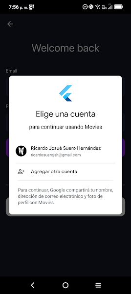
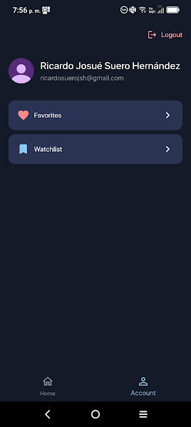

# Movie App

Una aplicación de películas desarrollada con Flutter, Firebase y la [TMDB API](https://developer.themoviedb.org/reference/intro/getting-started).

## Screenshots
  
  
  

## 🚀 Características

- **Autenticación:**  con correo electrónico o cuenta de Google.
- **Explora películas:** tendencia, populares y en cartelera.
- **Consulta detalles de películas:** como calificación, año de estreno, géneros, sinopsis y películas similares.
- **Agrega:** películas a favoritos o lista de seguimiento.
**Mínimo 6 pantallas funcionales y estilizadas:** Inicio, login, registro, pantalla principal, detalles de película, favoritos, edición de perfil, búsqueda.
- **Consumo de +4 endpoints TMDB:** películas populares, trending, top rated, detalles por ID, búsqueda.
- **Gestión avanzada de estado:** usando `Riverpod` + `StateNotifier` para vistas reactivas y eficientes.
- **Persistencia local:** manejo de sesión de usuario con `SharedPreferences`.
- **Interacción completa con API:** métodos `GET`, `POST`, `DELETE/PATCH` tanto en TMDB como Firestore.
- **Autenticación completa:** con Firebase (correo + Google).
- **Buenas prácticas de arquitectura:** patrón `Repository`, desacoplamiento por `features`, `core`, `viewmodels`, pruebas y mocks.

## 🧪 Pruebas

Se incluyen pruebas automatizadas en la carpeta `/test`:

- Unit tests: `auth_viewmodel_test`, `account_viewmodel_test`
- Widget tests: `edit_profile_screen_test`, `favorite_button_test`
- Mocking con `mockito` y `@GenerateMocks`

## 🛠️ Tecnologías
- **Flutter →** Desarrollo de la interfaz de usuario.
- **Firebase Authentication →** Manejo de autenticación de usuarios.
- **Cloud Firestore →** Almacenamiento de datos, favoritos y lista de seguimiento.
- **TMDB API →** Proporciona información de las películas.
- **Riverpod →** Gestión del estado y llamadas a la API.

## 📥 Instalación
1. Clona este repositorio
   ```
   git clone https://github.com/ricardoj12-sh/movieapp.git
   ``` 
3. Obtén tu clave de API en [TMDB] (https://developer.themoviedb.org/reference/intro/getting-started) y agrégala en el archivo lib/src/core/api.dart
   ```
   final String _apiKey = 'YOUR_API_KEY';
   ```
4. Crea un proyecto en Firebase.

Habilita Firebase Authentication (Email/Password + Google).

Habilita Cloud Firestore.

Añade el archivo google-services.json (Android)
