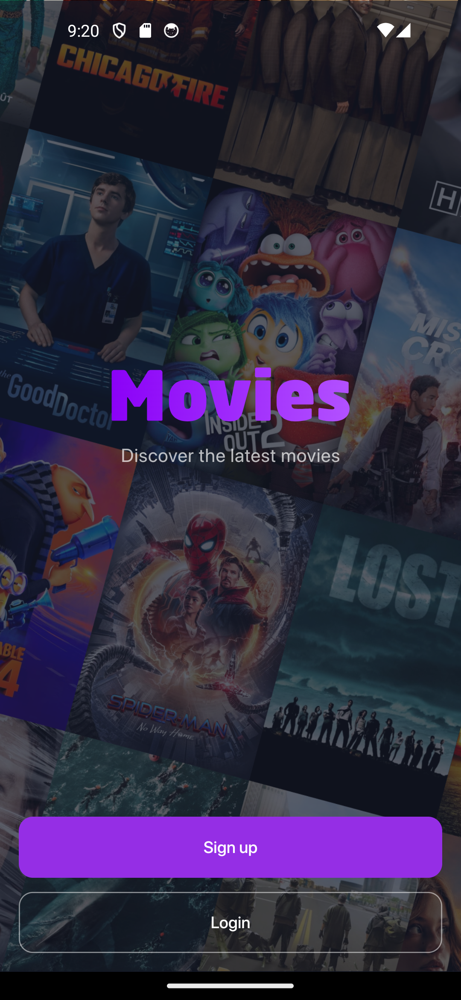
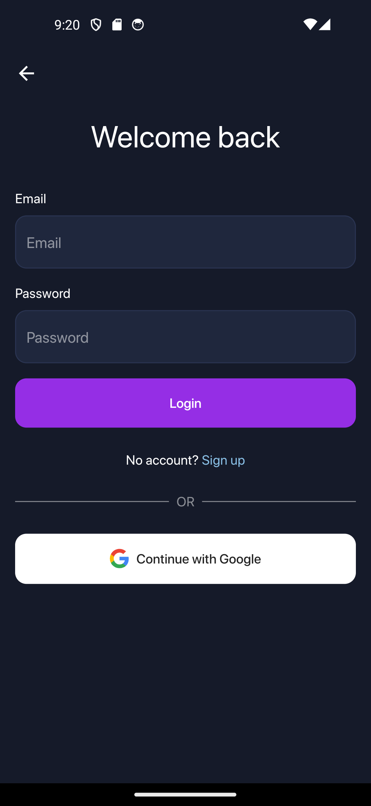
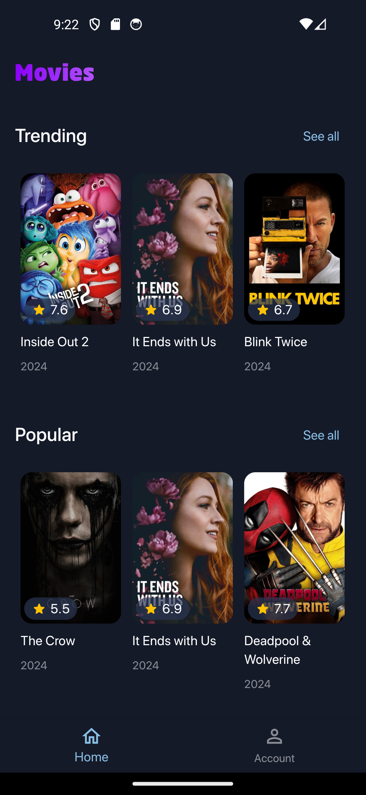
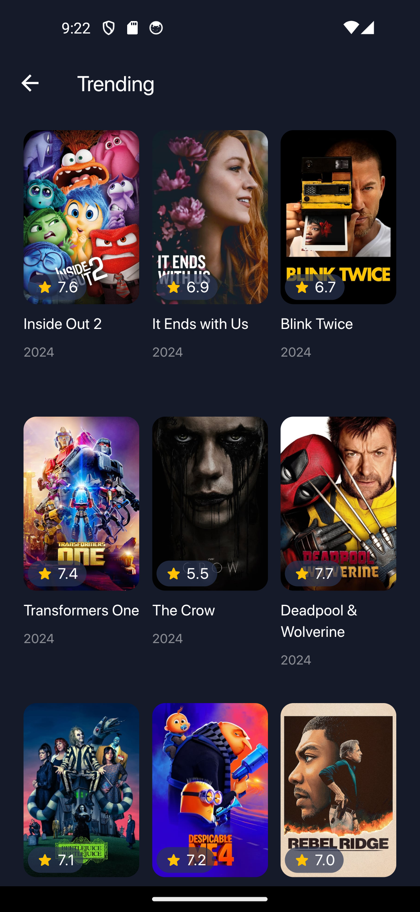
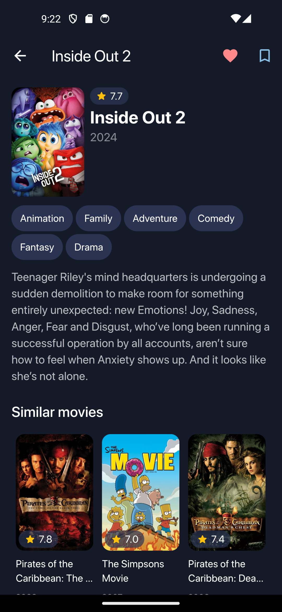
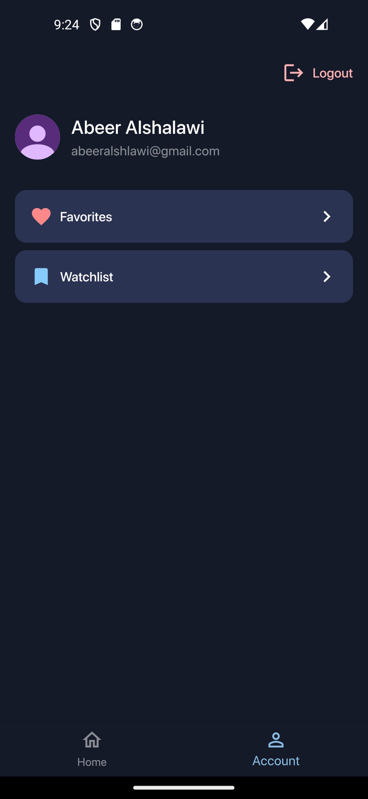
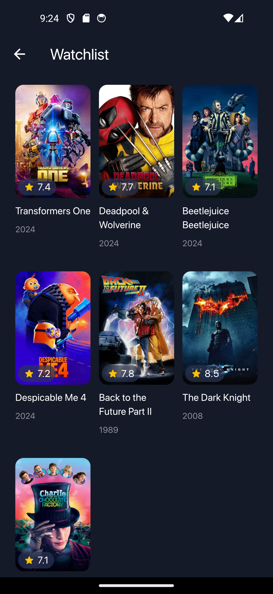

# Movie App

Una aplicación de películas desarrollada con Flutter, Firebase y la [TMDB API](https://developer.themoviedb.org/reference/intro/getting-started).

## Screenshots
  
  
 

## 🚀 Características

- **Autenticación:**  con correo electrónico o cuenta de Google.
- **Explora películas:** tendencia, populares y en cartelera.
- **Consulta detalles de películas:** como calificación, año de estreno, géneros, sinopsis y películas similares.
- **Agrega:** películas a favoritos o lista de seguimiento.

## 🛠️ Tecnologías
- **Flutter →** Desarrollo de la interfaz de usuario.
- **Firebase Authentication →** Manejo de autenticación de usuarios.
- **Cloud Firestore →** Almacenamiento de datos, favoritos y lista de seguimiento.
- **TMDB API →** Proporciona información de las películas.
- **Riverpod →** Gestión del estado y llamadas a la API.

## 📥 Instalación
1. Clona este repositorio
   ```
   git clone https://github.com/ricardoj12-sh/movieapp.git
   ``` 
3. Obtén tu clave de API en [TMDB] (https://developer.themoviedb.org/reference/intro/getting-started) y agrégala en el archivo lib/src/core/api.dart
   ```
   final String _apiKey = 'YOUR_API_KEY';
   ```
5. Configura Firebase creando un proyecto y habilitando Firebase Authentication y Firestore Database.
